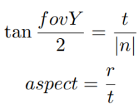
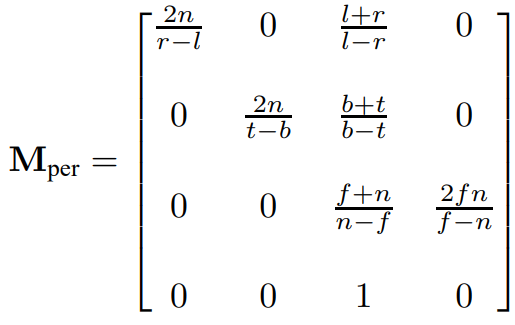
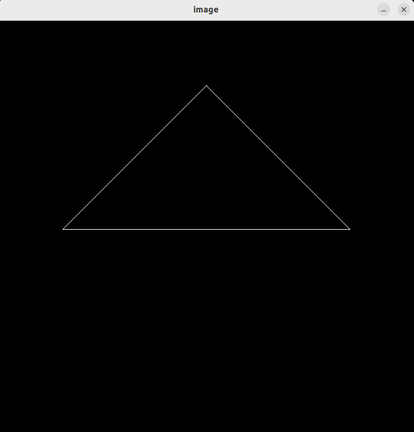

# Formula
  

# Code
**model**
```
    float cosValue = cos(rotation_angle / 180 * acos(-1));
    float sinValue = sin(rotation_angle / 180 * acos(-1));

    model << cosValue, -sinValue, 0, 0,
             sinValue,  cosValue, 0, 0,
                0,         0,     1, 0,
                0,         0,     0, 1;
```
**projection**
```
    float n = abs(zFar-zNear);
    float t = -n * tan(eye_fov/2/180*acos(-1));
    float b = -t;
    float r = t * aspect_ratio;
    float l = -r;

    projection << 2*n/(r-l), 0,        (l+r)/(l-r),               0,
                  0,        2*n/(t-b), (b+t)/(b-t),               0,
                  0,        0,         (zNear+zFar)/(zNear-zFar), 2*zNear*zFar/(zFar-zNear),
                  0,        0,          1,                        0;
```
# Result

