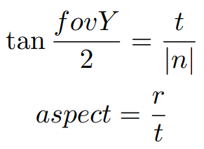
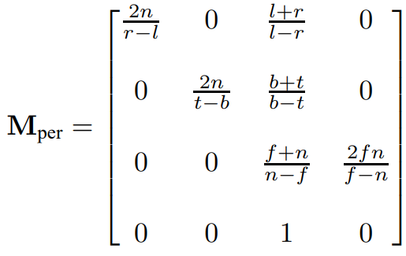
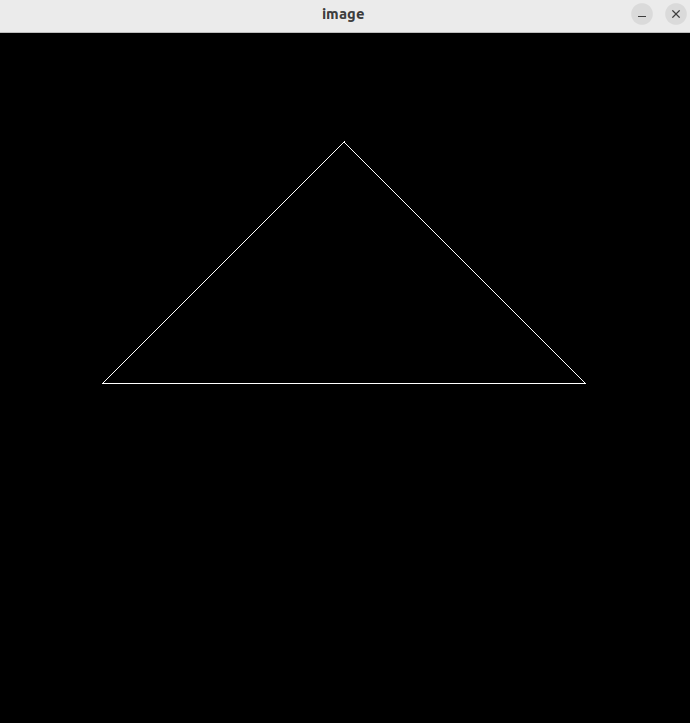
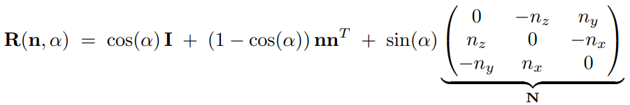
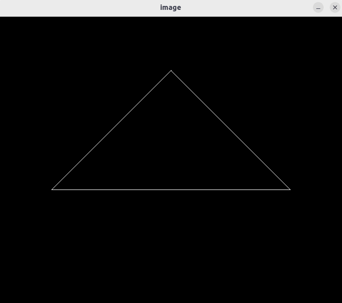

# Formula
  

# Code
**model**
```
    float cosValue = cos(rotation_angle / 180 * acos(-1));
    float sinValue = sin(rotation_angle / 180 * acos(-1));

    model << cosValue, -sinValue, 0, 0,
             sinValue,  cosValue, 0, 0,
                0,         0,     1, 0,
                0,         0,     0, 1;
```
**projection**
```
    float t = tan(eye_fov/2/180*acos(-1));

    projection << -1/t*aspect_ratio, 0,    0,                         0,
                          0,         -1/t, 0,                         0,
                          0,         0,    (zNear+zFar)/(zNear-zFar), 2*zNear*zFar/(zFar-zNear),
                          0,         0,    1,                         0;
```
# Result

# 提高
## Formula
  
## Code
```
Eigen::Matrix4f get_rotation(Vector3f axis, float angle)
{
    axis = axis.normalized();
    Eigen::Vector4f axis4f = {axis[0], axis[1], axis[2], 0};

    Eigen::Matrix4f rotation;
    Eigen::Matrix4f I = Eigen::Matrix4f::Identity();
    Eigen::Matrix4f N = Eigen::Matrix4f::Identity();
    N << 0,        -axis[2], axis[1],  0,
         axis[2],  0,        -axis[0], 0,
         -axis[1], -axis[0],  0,       0,
         0,        0,         0,       1;
    
    float cosValue = cos(angle / 180 * acos(-1));
    float sinValue = sin(angle / 180 * acos(-1));

    rotation = cosValue * I + (1-cosValue) * (axis4f * axis4f.transpose()) + sinValue * N;
    rotation(3,3)=1;

    return rotation;
}
```
## Result
